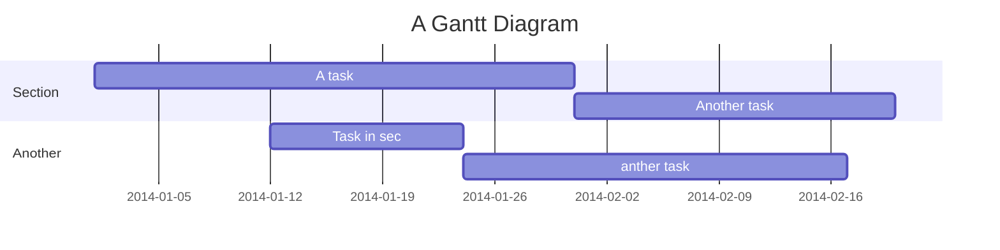

# lciclcAzz Docker Base 
Base image of the lciclcAzz & xDreamsBox Company.


### Mermaid


> More information about **sequence diagrams** syntax [here](http://bramp.github.io/js-sequence-diagrams/).
> More information about **flow charts** syntax [here](http://adrai.github.io/flowchart.js/).
> More information about **graphviz** syntax [here](http://www.tonyballantyne.com/graphs.html)
> More information about **mermaid** syntax [here](http://knsv.github.io/mermaid)


## Features :
This editor provides full auto-complete hints in markdown.
- Emojis: type `:` to show hints.
- Code blocks: type ` ``` ` and plus a character to show hint. <i hidden>```</i>
- Headers: type `#` to show hint.
- Referrals: type `[]` to show hint.
- Externals: type `{}` to show hint.
- Images: type `!` to show hint.

## Title:
This will take the first **level 1 header** as the note title.

## Tags:
Using tags as follows, the specified tags will show in your **history**.
###### tags: `features` `cool` `updated`

## ToDo List:
- [ ] ToDos
  - [x] Buy some salad
  - [ ] Brush teeth
  - [x] Drink some water

===
## Shortcut Keys:
Just like Sublime text, which is pretty quick and convenient.
> For more infomation, see [here](https://codemirror.net/demo/sublime.html).

  
## Code Block:
We support many programming languages, use the auto complete function to see the entire list.
```javascript=
var s = "JavaScript syntax highlighting";
alert(s);
function $initHighlight(block, cls) {
  try {
    if (cls.search(/\bno\-highlight\b/) != -1)
      return process(block, true, 0x0F) + 
             ' class=""';
  } catch (e) {
    /* handle exception */
  }
  for (var i = 0 / 2; i < classes.length; i++) {
    if (checkCondition(classes[i]) === undefined)
      return /\d+[\s/]/g;
  }
}
```
> If you want **line numbers**, type `=` after specifying the code block languagues.
> Also, you can specify the start line number.
> Like below, the line number starts from 101:

## ToC:
Use the syntax `[TOC]` to embed table of content into your note.

[TOC]

## Externals

### YouTube


